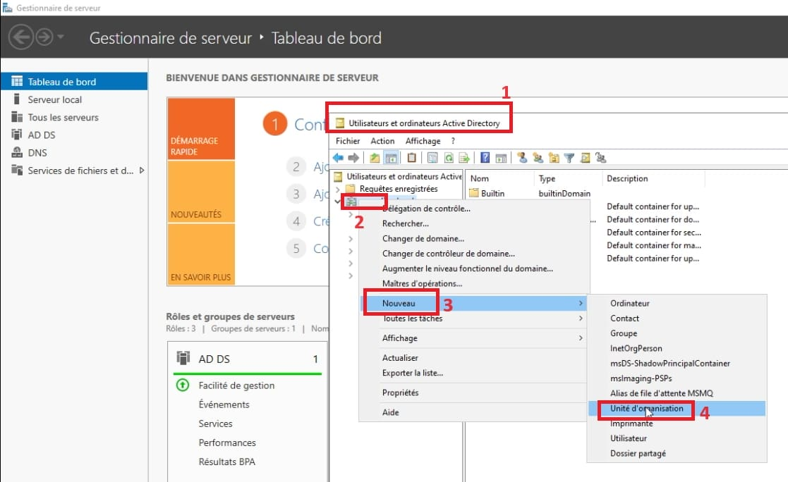

## Création d'une Unité d'Organisation Wilders_students
 
1. Créer l'Unité d'Organisation (OU) Wilders_students

Étapes :
Ouvrir Active Directory Users and Computers (ADUC).
Dans le panneau de gauche, faites un clic droit sur le domaine dans lequel vous souhaitez créer l'OU (ex : votre-domaine.local).
Sélectionnez New > Organizational Unit.
Dans la fenêtre qui s'ouvre, nommez l'OU : Wilders_students.
Cochez l'option Protect container from accidental deletion si elle n'est pas déjà activée.
Cliquez sur OK.
L'OU Wilders_students a maintenant été créée sous votre domaine.

2. Créer un Groupe d'Utilisateurs Students
Un Groupe d'Utilisateurs dans Active Directory est utilisé pour regrouper des utilisateurs ayant des besoins ou des droits similaires. Ici, nous allons créer un groupe pour tous les étudiants.

Étapes :
Dans Active Directory Users and Computers, sélectionnez l'OU Wilders_students que vous venez de créer.
Faites un clic droit sur l'OU Wilders_students et sélectionnez New > Group.
Dans la fenêtre New Object - Group :
Nom : Students
Groupe scope : Global
Type de groupe : Security (pour gérer les permissions de sécurité)
Cliquez sur OK.
Le groupe Students est maintenant créé dans l'OU Wilders_students.

3. Créer un Utilisateur et l'Ajouter au Groupe Students
Maintenant, nous allons créer un utilisateur (par exemple, jean.dupont) et l'ajouter au groupe Students.

Étapes :
Dans Active Directory Users and Computers, sélectionnez l'OU Wilders_students.
Faites un clic droit sur l'OU Wilders_students et sélectionnez New > User.
Dans la fenêtre New Object - User :
First name : Jean
Last name : Dupont
Full name : Jean Dupont
User logon name : jean.dupont (nom d'utilisateur pour la connexion)
Cliquez sur Next.
Définissez un mot de passe pour l'utilisateur (ex : P@ssw0rd!).
Cochez les options nécessaires, comme User must change password at next logon si vous souhaitez obliger l'utilisateur à changer son mot de passe lors de sa première connexion.
Cliquez sur Next, puis sur Finish pour créer l'utilisateur.
Ajouter l'Utilisateur au Groupe Students :
Dans Active Directory Users and Computers, faites un clic droit sur le groupe Students dans l'OU Wilders_students.
Sélectionnez Properties.
Allez dans l'onglet Members et cliquez sur Add.
Dans la fenêtre de recherche, tapez jean.dupont et cliquez sur Check Names pour vérifier l'existence de l'utilisateur.
Cliquez sur OK pour ajouter l'utilisateur au groupe.
L'utilisateur Jean Dupont est maintenant membre du groupe Students.

Conclusion
Vous avez maintenant créé :

Une Unité d'Organisation (OU) Wilders_students.
Un Groupe d'Utilisateurs Students.
Un Utilisateur Jean Dupont qui a été ajouté au groupe Students.
Cette organisation permet de gérer facilement les utilisateurs et groupes dans votre environnement Active Directory.
