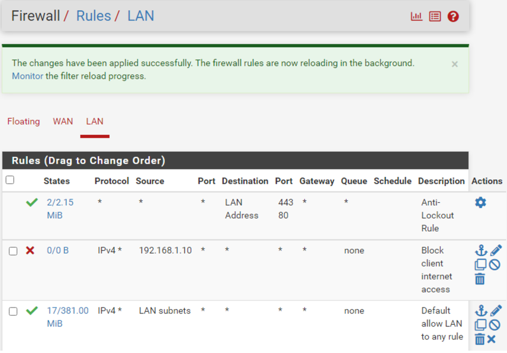
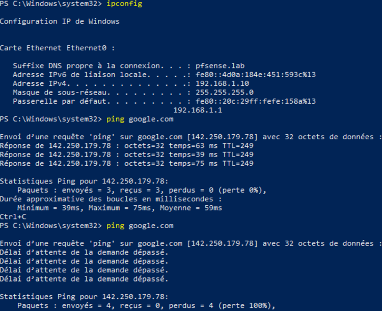
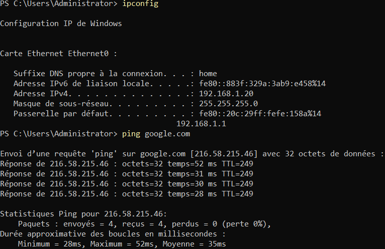

# Installation du firewall pfSense
````
Installer PfSense sur une VM, avec 2 adaptateurs WAN (en bridge) et LAN (en réseau internet).
Lancer une VM Windows Server 2022 (admin) et une VM Windows 10 (client) toutes deux sur le même adaptateur LAN.
L'interface LAN du firewall : 192.168.1.1/24
- IP du client en Windows 10 : 192.168.1.10/24
- IP de l'admin en Windows Server 2022 : 192.168.1.20/24
Une fois le firewall installé, vérifier que l'interface en bridge communique avec internet. (En exemple faire un ping de google.com.)
````

## Mise en place d'une règle dans le Firewall 
````
Mettre une règle dans le Firewall -> Rules pour bloquer l'accès internet au client.
Ensuite, indiquer comme source dans la partie LAN l'adresse IP du client.
Il est aussi possible de créer un alias pour utiliser l'adresse MAC du client.
Sélectionnez les protocoles à bloquer (ici nous les bloquons tous) et indiquer la destination (ici le WAN).
````

 

👉 **Le second ping ne marche pas alors il faut faire un ping vers internet puis appliquer la règle précédemment définie.**

 

👉 **Faire un ping sur le pc admin afin de vérifier si la connexion internet est toujours accessible.**


