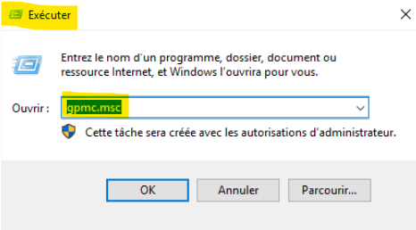
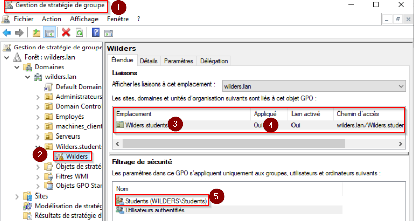

# Critères d'acceptation
- Tapez **gpmc.msc** dans la fenêtre Exécuter comme sur la capture d'écran ci-dessous.
- Sélectionnez la foret wilders.lan puis le groupe d'utilisiateurs wilders_students
- Clic droit et selectionnez la 1ère option
- Nommez la GPO "wilders" et validez
- Selectionnez la gpo et faites clic droit "éditer"
- Configuration Utilisateur -> Paramètres Windows -> Tempaltes Administratifs -> Panneau de configuration -> Interdire l'accès au panneau de configuration
- Clic gauche puis clic droit "editer" et activez le paramètre
- Je me déconnecte de mon utilisateur admin et me connecte à l'utilisateur Samia qui fait partie du groupe wilders_students
- Et pour finir je teste d'ouvrir le panneau de configuration. 

